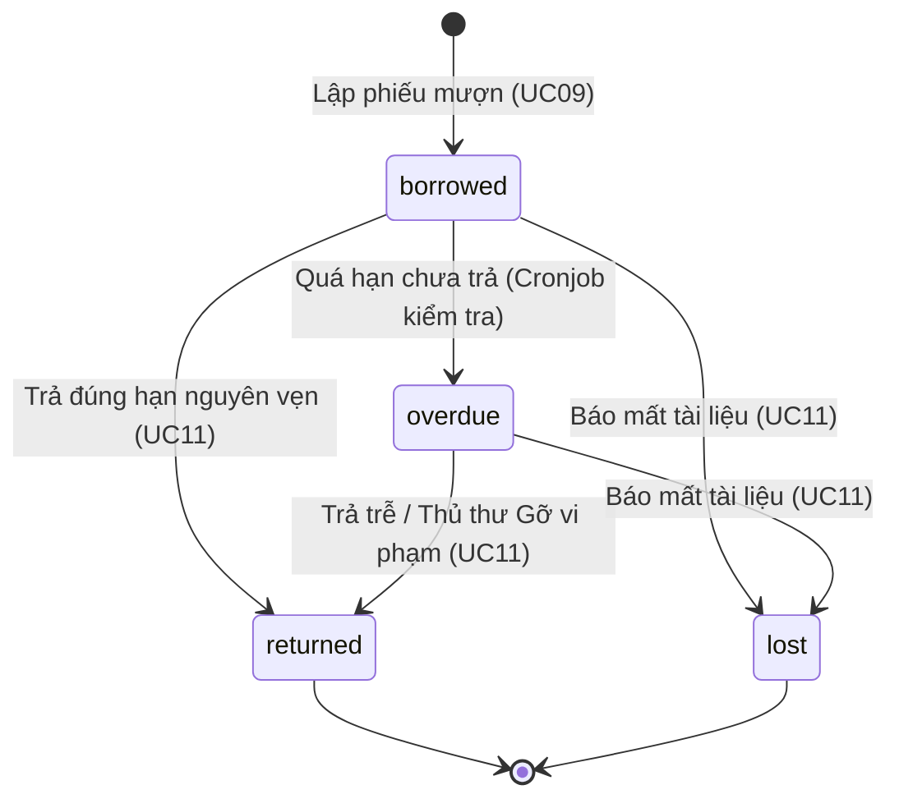

# BỘ TEST CASE KIỂM THỬ TOÀN DIỆN HỆ THỐNG LiMS (TẤT CẢ USE CASES)

**Tài liệu hệ thống:** `SRS_DEHA_NHOM2_v4.0.md` & `SRS_DEHA_NHOM2_v5.0.md`  
**Phương pháp kiểm thử:** Black-box Testing (Equivalence Partitioning - ECP, Boundary Value Analysis - BVA, Decision Table, State Transition, Error Guessing).  
**Phạm vi bao phủ:** Giao diện người dùng (**UI/UX Layer**), Logic nghiệp vụ (**MVT / Business Rules**), và Dữ liệu nền (**MySQL ACID Transactions & Celery Async Tasks**).

---

## 🗂 MỤC LỤC CHI TIẾT
1. [Nhóm 1: Xác thực & Tài khoản cá nhân (UC01, UC02, UC19, UC20)](#nhóm-1-xác-thực--tài-khoản-cá-nhân)
2. [Nhóm 2: Quản trị Người dùng (UC03a - UC03e)](#nhóm-2-quản-trị-người-dùng)
3. [Nhóm 3: Quản lý Kho sách & Danh mục (UC04a - UC04e, UC18)](#nhóm-3-quản-lý-kho-sách--danh-mục)
4. [Nhóm 4: Đề xuất & Phê duyệt sách theo chuẩn ISBN (UC05, UC06)](#nhóm-4-đề-xuất--phê-duyệt-sách-theo-chuẩn-isbn)
5. [Nhóm 5: Tra cứu, Đánh giá & Thống kê (UC07, UC12, UC14, UC15)](#nhóm-5-tra-cứu-đánh-giá--thống-kê)
6. [Nhóm 6: Lưu thông Sách & Quản lý Tín nhiệm (UC08, UC09 chuyên sâu 22 TC, UC10, UC11, UC16)](#nhóm-6-lưu-thông-sách--quản-lý-tín-nhiệm)
7. [Ma trận Quyết định & Sơ đồ Trạng thái](#ma-trận-quyết-định--sơ-đồ-trạng-thái)

---

## NHÓM 1: XÁC THỰC & TÀI KHOẢN CÁ NHÂN

### UC01 – Đăng nhập vào Hệ thống
| Mã TC | Tên Test Case / Mục tiêu | Tiền điều kiện | Các bước thực hiện | Input Data | Kết quả mong đợi (Expected Result) | Loại TC | Ưu tiên |
|:---|:---|:---|:---|:---|:---|:---:|:---:|
| **TC_01_UI01** | Kiểm tra hiển thị form đăng nhập và hiệu ứng focus | Trình duyệt mở `/accounts/login/` | 1. Mở trang đăng nhập 2. Kiểm tra các trường thông tin | N/A | Form hiển thị rõ ràng với trường Username/Email và Password. Trỏ chuột tự động focus vào ô Username. Có nút biểu tượng mắt ẩn/hiện mật khẩu. | UI/UX | P3 |
| **TC_01_HP01** | Sinh viên đăng nhập thành công bằng Username/Email | Tài khoản `student1` hợp lệ (`is_active=True`) | 1. Nhập username `student1` 2. Nhập mật khẩu hợp lệ 3. Bấm Đăng nhập | `u="student1"` `p="password123"` | Đăng nhập thành công. Chuyển hướng về trang chủ (`/`). Hiển thị lời chào "Xin chào student1" trên thanh điều hướng. | Happy | P1 |
| **TC_01_HP02** | Admin / Thủ thư đăng nhập nhanh không cần qua OTP (cập nhật mới tiện demo) | Tài khoản `admin` hoặc `librarian` hợp lệ | 1. Nhập tài khoản Admin/Thủ thư 2. Nhập mật khẩu 3. Bấm Đăng nhập | `u="admin"` `p="password123"` | Đăng nhập thẳng vào Dashboard/Quản trị không bị block bởi màn hình xác thực OTP 2FA. | Happy | P1 |
| **TC_01_EX01** | Đăng nhập thất bại do sai mật khẩu hoặc tài khoản không tồn tại | Mở form đăng nhập | 1. Nhập sai mật khẩu 1 hoặc nhiều lần | `u="student1"` `p="wrongpass"` | Hệ thống từ chối đăng nhập. Hiển thị thông báo lỗi: "Tên đăng nhập hoặc mật khẩu không chính xác". | Exception | P1 |
| **TC_01_EX02** | Chặn đăng nhập khi tài khoản bị khóa/vô hiệu hóa | Tài khoản `student_locked` có `is_active=False` | 1. Nhập tài khoản bị khóa và mật khẩu đúng | `u="student_locked"` | Từ chối đăng nhập. Hiển thị cảnh báo đỏ: "Tài khoản của bạn đã bị vô hiệu hóa, vui lòng liên hệ quản trị viên". | Exception | P1 |
| **TC_01_EG01** | Kiểm tra bảo mật chống SQL Injection / XSS qua ô đăng nhập | Mở form đăng nhập | 1. Nhập chuỗi tấn công vào ô username | `u="' OR 1=1 --"` | Hệ thống escape chuỗi an toàn, trả về lỗi sai tài khoản mật khẩu bình thường không để lộ lỗi SQL. | Edge | P1 |

### UC02 – Đổi mật khẩu
| Mã TC | Tên Test Case / Mục tiêu | Tiền điều kiện | Các bước thực hiện | Input Data | Kết quả mong đợi (Expected Result) | Loại TC | Ưu tiên |
|:---|:---|:---|:---|:---|:---|:---:|:---:|
| **TC_02_HP01** | Người dùng đổi mật khẩu thành công | Đã đăng nhập vào hệ thống | 1. Vào mục Đổi mật khẩu 2. Nhập mật khẩu hiện tại 3. Nhập mật khẩu mới khớp nhau 4. Lưu | `old="password123"` `new="NewPass@456"` | Đổi mật khẩu thành công. Cập nhật hash trong DB. Giữ nguyên phiên đăng nhập hiện tại hoặc yêu cầu đăng nhập lại một cách mượt mà. | Happy | P2 |
| **TC_02_EX01** | Đổi mật khẩu thất bại do nhập sai mật khẩu hiện tại | Đã đăng nhập | 1. Nhập sai mật khẩu cũ 2. Nhập mật khẩu mới hợp lệ | `old="wrongold"` | Từ chối cập nhật. Báo lỗi ngay tại ô mật khẩu hiện tại: "Mật khẩu hiện tại không đúng". | Exception | P2 |
| **TC_02_EX02** | Mật khẩu mới và xác nhận mật khẩu mới không khớp | Đã đăng nhập | 1. Nhập mật khẩu mới và ô xác nhận khác nhau | `new1="Pass123"` `new2="Pass456"` | Client/Server validation chặn lại, báo lỗi: "Mật khẩu xác nhận không trùng khớp". | Exception | P2 |

### UC19 – Đăng xuất khỏi Hệ thống
| Mã TC | Tên Test Case / Mục tiêu | Tiền điều kiện | Các bước thực hiện | Input Data | Kết quả mong đợi (Expected Result) | Loại TC | Ưu tiên |
|:---|:---|:---|:---|:---|:---|:---:|:---:|
| **TC_19_HP01** | Đăng xuất thành công và xóa session | Đã đăng nhập | 1. Click nút "Đăng xuất" trên menu user | N/A | Hệ thống hủy Django Session, xóa cookie đăng nhập. Chuyển hướng người dùng về trang Đăng nhập. | Happy | P2 |
| **TC_19_EG01** | Không thể bấm nút Back (lùi trang) sau khi đăng xuất | Đã bấm Đăng xuất | 1. Bấm nút mũi tên lùi (Back) trên trình duyệt | N/A | Trình duyệt không thể truy cập lại trang nội bộ. Hệ thống yêu cầu đăng nhập lại do session đã hủy. | Edge | P2 |

### UC20 – Xem / Quản lý Hồ sơ cá nhân
| Mã TC | Tên Test Case / Mục tiêu | Tiền điều kiện | Các bước thực hiện | Input Data | Kết quả mong đợi (Expected Result) | Loại TC | Ưu tiên |
|:---|:---|:---|:---|:---|:---|:---:|:---:|
| **TC_20_HP01** | Hiển thị chính xác thông tin hồ sơ & trạng thái tín nhiệm | Đã đăng nhập (`student1`) | 1. Truy cập trang Hồ sơ cá nhân | N/A | Hiển thị đầy đủ: Họ tên, Email, Vai trò, Số điện thoại. Đặc biệt hiển thị rõ trạng thái Tín nhiệm (Quyền mượn sách: Đang mở / Bị khóa). | Happy | P2 |
| **TC_20_HP02** | Cập nhật thông tin cá nhân (Số điện thoại, địa chỉ) | Đã mở trang Hồ sơ | 1. Sửa số điện thoại 2. Bấm Lưu thay đổi | `phone="0987654321"` | Lưu thành công, hiển thị thông báo Toast: "Cập nhật hồ sơ thành công". | Happy | P3 |

---

## NHÓM 2: QUẢN TRỊ NGƯỜI DÙNG

### UC03a – Thêm mới Người dùng
| Mã TC | Tên Test Case / Mục tiêu | Tiền điều kiện | Các bước thực hiện | Input Data | Kết quả mong đợi (Expected Result) | Loại TC | Ưu tiên |
|:---|:---|:---|:---|:---|:---|:---:|:---:|
| **TC_03A_HP01** | Admin thêm mới thành công một Thủ thư hoặc Sinh viên | Đăng nhập với quyền `admin` | 1. Vào Quản lý người dùng $\rightarrow$ Thêm mới 2. Điền thông tin và chọn vai trò `librarian` | `u="lib2"`, `email="lib2@test.com"` | Tạo thành công user mới trong CSDL. Mật khẩu được mã hóa an toàn. | Happy | P1 |
| **TC_03A_EX01** | Chặn tạo tài khoản trùng Username hoặc trùng Email | Đang ở form thêm mới user | 1. Nhập username `student1` (đã tồn tại trong DB) 2. Bấm Lưu | `u="student1"` | Báo lỗi: "Tên đăng nhập này đã được sử dụng, vui lòng chọn tên khác". | Exception | P1 |

### UC03b – Xem danh sách & Chi tiết Người dùng
| Mã TC | Tên Test Case / Mục tiêu | Tiền điều kiện | Các bước thực hiện | Input Data | Kết quả mong đợi (Expected Result) | Loại TC | Ưu tiên |
|:---|:---|:---|:---|:---|:---|:---:|:---:|
| **TC_03B_HP01** | Lọc danh sách người dùng theo vai trò (Role filter) | Admin mở trang Quản lý người dùng | 1. Chọn bộ lọc "Thủ thư" 2. Bấm Lọc | `role="librarian"` | Bảng chỉ hiển thị các tài khoản có vai trò Thủ thư. | Happy | P2 |
| **TC_03B_HP02** | Tìm kiếm nhanh tài khoản theo họ tên hoặc mã SV | Có 100 users trong hệ thống | 1. Nhập từ khóa vào ô tìm kiếm nhanh | `q="Nguyễn Văn A"` | Trả về kết quả chính xác không reload trang (HTMX search). | Happy | P2 |

### UC03c – Cập nhật thông tin Người dùng & UC03d – Kích hoạt / Vô hiệu hóa Tài khoản
| Mã TC | Tên Test Case / Mục tiêu | Tiền điều kiện | Các bước thực hiện | Input Data | Kết quả mong đợi (Expected Result) | Loại TC | Ưu tiên |
|:---|:---|:---|:---|:---|:---|:---:|:---:|
| **TC_03C_HP01** | Admin cập nhật vai trò người dùng (Từ SV lên Thủ thư) | Đăng nhập Admin | 1. Chọn user `student2` 2. Đổi role thành `librarian` 3. Lưu | `role="librarian"` | Cập nhật thành công. User lập tức có quyền hạn của Thủ thư khi truy cập. | Happy | P1 |
| **TC_03D_HP01** | Khóa tài khoản vi phạm nặng (`is_active=False`) | Đăng nhập Admin | 1. Bấm gạt công tắc Trạng thái tài khoản của `student2` sang Tắt | `is_active=False` | Cập nhật trạng thái ngay lập tức bằng AJAX. Nếu `student2` đang đăng nhập, các request tiếp theo sẽ bị từ chối. | Happy | P1 |

### UC03e – Import Người dùng hàng loạt từ Excel
| Mã TC | Tên Test Case / Mục tiêu | Tiền điều kiện | Các bước thực hiện | Input Data | Kết quả mong đợi (Expected Result) | Loại TC | Ưu tiên |
|:---|:---|:---|:---|:---|:---|:---:|:---:|
| **TC_03E_HP01** | Import thành công file Excel chứa 50 sinh viên hợp lệ | File `.xlsx` chuẩn theo template | 1. Chọn file Excel 2. Bấm Upload & Import | `users.xlsx` | Hệ thống đọc file, tạo bulk 50 tài khoản thành công. Báo cáo: "Đã nhập thành công 50/50 tài khoản". | Happy | P2 |
| **TC_03E_EX01** | Xử lý file Excel bị lỗi định dạng hoặc trùng lặp email | File Excel có 2 dòng bị trùng email với DB | 1. Upload file lỗi | `bad_users.xlsx` | Hệ thống rollback hoặc bỏ qua dòng lỗi, hiển thị thông báo chi tiết: "Dòng 12: Email đã tồn tại trong hệ thống". | Exception | P2 |

---

## NHÓM 3: QUẢN LÝ KHO SÁCH & DANH MỤC

### UC04a – Thêm mới Sách & UC18 – Quản lý Danh mục (Category/Publisher)
| Mã TC | Tên Test Case / Mục tiêu | Tiền điều kiện | Các bước thực hiện | Input Data | Kết quả mong đợi (Expected Result) | Loại TC | Ưu tiên |
|:---|:---|:---|:---|:---|:---|:---:|:---:|
| **TC_04A_HP01** | Thủ thư thêm sách mới thành công kèm ảnh bìa | Đăng nhập `librarian` | 1. Nhập Tiêu đề, ISBN, Tác giả, Thể loại, Số lượng 2. Upload file ảnh bìa `.jpg` 3. Lưu | `isbn="978604123"` `copies=10` | Sách được tạo mới với `total_copies=10`, `available_copies=10`. Ảnh bìa lưu đúng vào thư mục `/media/books/`. | Happy | P1 |
| **TC_04A_EX01** | Chặn thêm sách có số lượng bản sao âm (`total_copies < 0`) | Mở form thêm sách | 1. Nhập số lượng tổng là `-5` 2. Bấm Lưu | `copies=-5` | Client/Server validation chặn lại: "Số lượng sách phải là số nguyên dương". | Exception | P2 |
| **TC_18_HP01** | Thêm nhanh Thể loại sách mới trực tiếp từ Modal | Đang ở form thêm sách | 1. Click icon (+) cạnh ô Thể loại 2. Nhập tên thể loại "AI & Data" 3. Bấm Lưu | `name="AI & Data"` | Thể loại mới được tạo nhanh qua AJAX và tự động được chọn vào ô dropdown mà không mất dữ liệu đang gõ dở. | UI/UX | P2 |

### UC04b, UC04c, UC04d – Xem, Cập nhật & Xóa Sách
| Mã TC | Tên Test Case / Mục tiêu | Tiền điều kiện | Các bước thực hiện | Input Data | Kết quả mong đợi (Expected Result) | Loại TC | Ưu tiên |
|:---|:---|:---|:---|:---|:---|:---:|:---:|
| **TC_04C_HP01** | Cập nhật tăng số lượng tổng kho khi nhập thêm sách mới | Sách hiện có `total=10, available=5` | 1. Sửa `total_copies` lên `15` 2. Lưu | `total=15` | Hệ thống tính toán lại tự động: `available_copies = 5 + (15 - 10) = 10`. | Happy | P1 |
| **TC_04D_EX01** | Chặn xóa sách khi đang có sinh viên mượn chưa trả | Sách đang có `BorrowRecord` trạng thái `borrowed` | 1. Bấm Xóa cuốn sách này | `book_id` | Từ chối xóa. Hiển thị thông báo: "Không thể xóa sách do đang có 5 cuốn đang được độc giả mượn". | Exception | P1 |

### UC04e – Import Sách hàng loạt từ Excel
| Mã TC | Tên Test Case / Mục tiêu | Tiền điều kiện | Các bước thực hiện | Input Data | Kết quả mong đợi (Expected Result) | Loại TC | Ưu tiên |
|:---|:---|:---|:---|:---|:---|:---:|:---:|
| **TC_04E_HP01** | Import danh mục 100 đầu sách từ file Excel chuẩn | File `.xlsx` chuẩn | 1. Upload file và import | `books.xlsx` | Nhập dữ liệu nhanh chóng vào DB trong một transaction duy nhất. Hiển thị kết quả thành công. | Happy | P2 |

---

## NHÓM 4: ĐỀ XUẤT & PHÊ DUYỆT SÁCH THEO CHUẨN ISBN

### UC05 – Gửi yêu cầu mua sách mới
| Mã TC | Tên Test Case / Mục tiêu | Tiền điều kiện | Các bước thực hiện | Input Data | Kết quả mong đợi (Expected Result) | Loại TC | Ưu tiên |
|:---|:---|:---|:---|:---|:---|:---:|:---:|
| **TC_05_HP01** | Sinh viên gửi đề xuất mua sách với mã ISBN bắt buộc | Đã đăng nhập (`student1`) | 1. Mở trang Đề xuất sách 2. Điền Tên sách, Tác giả, ISBN, Lý do 3. Gửi | `isbn="9780132350884"` `title="Clean Code"` | Tạo bản ghi `BookProposal` trạng thái `pending`. Hiển thị trong danh sách đề xuất cá nhân. | Happy | P1 |
| **TC_05_EX01** | Chặn gửi đề xuất khi bỏ trống ô ISBN chuẩn hóa | Mở form đề xuất | 1. Nhập tên sách nhưng để trống ISBN | `isbn=""` | Form báo lỗi bắt buộc nhập: "Vui lòng nhập mã ISBN để thư viện định danh chính xác ấn phẩm". | Exception | P1 |

### UC06 – Phê duyệt yêu cầu mua sách (ISBN Grouping & Mass Approve)
| Mã TC | Tên Test Case / Mục tiêu | Tiền điều kiện | Các bước thực hiện | Input Data | Kết quả mong đợi (Expected Result) | Loại TC | Ưu tiên |
|:---|:---|:---|:---|:---|:---|:---:|:---:|
| **TC_06_UI01** | Gom nhóm thông minh các đề xuất có cùng mã ISBN trên giao diện | Có 3 người dùng cùng đề xuất mua sách có ISBN `9780132350884` | 1. Thủ thư vào trang Duyệt đề xuất (`/proposals/review/`) | N/A | Bảng tự động gom 3 yêu cầu thành 1 dòng đại diện. Hiển thị cột `Số lượt đề xuất: 3` và danh sách người yêu cầu `student1, student2, lecturer1`. | UI/UX | P1 |
| **TC_06_HP01** | Phê duyệt đồng loạt (Mass Approve) tất cả yêu cầu cùng ISBN | Nhóm đề xuất ISBN `9780132350884` đang chờ duyệt | 1. Bấm nút "Phê duyệt" trên dòng đại diện 2. Nhập lời nhắn "Đã đặt mua từ NXB" 3. Xác nhận | `action="approved"` | Tất cả 3 bản ghi trong DB cùng mã ISBN được chuyển trạng thái sang `approved` cùng lúc. Gửi email thông báo tự động cho cả 3 người đề xuất. | Happy | P1 |
| **TC_06_HP02** | Từ chối đề xuất mua sách kèm lý do cụ thể | Đề xuất sách không phù hợp | 1. Bấm "Từ chối" 2. Nhập lý do "Sách đã có bản điện tử trong thư viện" | `action="rejected"` | Chuyển trạng thái sang `rejected`, ghi nhận phản hồi vào DB để sinh viên theo dõi. | Happy | P2 |

---

## NHÓM 5: TRA CỨU, ĐÁNH GIÁ & THỐNG KÊ

### UC07 – Tra cứu & Xem chi tiết Sách (Kiểm soát Guest BR-30)
| Mã TC | Tên Test Case / Mục tiêu | Tiền điều kiện | Các bước thực hiện | Input Data | Kết quả mong đợi (Expected Result) | Loại TC | Ưu tiên |
|:---|:---|:---|:---|:---|:---|:---:|:---:|
| **TC_07_EX01** | Chặn Khách vãng lai (Guest) truy cập trang danh sách sách | Chưa đăng nhập vào hệ thống | 1. Gõ URL `/catalog/` trên trình duyệt | N/A | Bị chặn và chuyển hướng bắt buộc về `/accounts/login/?next=/catalog/`. | Security | P1 |
| **TC_07_EX02** | Chặn Khách vãng lai xem trang chi tiết tài liệu | Chưa đăng nhập | 1. Gõ URL `/catalog/book/1/` | `id=1` | Chuyển hướng ngay lập tức về trang Đăng nhập. | Security | P1 |
| **TC_07_EX03** | Chặn Khách vãng lai sử dụng API tra cứu sách | Gọi qua Postman / AJAX không có session | 1. Gửi GET request đến `/catalog/search/?q=Django` | `q="Django"` | Trả về mã lỗi HTTP 302 hoặc 403 Forbidden. | Security | P1 |
| **TC_07_HP01** | Tìm kiếm sách case-insensitive thành công theo từ khóa | Đã đăng nhập (`student1`) | 1. Nhập từ khóa "PYthOn" vào thanh tìm kiếm | `q="PYthOn"` | Trả về danh sách sách liên quan đến Python không phân biệt hoa thường. | Happy | P1 |
| **TC_07_UI01** | Chuyển trang mượt mà bằng AJAX (HTMX Pagination) | Có 50 sách trong kho | 1. Cuộn xuống chân trang bấm Trang 2 | N/A | Danh sách sách được làm mới không cần reload trình duyệt, giữ sự mượt mà. | UI/UX | P2 |

### UC12 – Đánh giá Tài liệu (Review System)
| Mã TC | Tên Test Case / Mục tiêu | Tiền điều kiện | Các bước thực hiện | Input Data | Kết quả mong đợi (Expected Result) | Loại TC | Ưu tiên |
|:---|:---|:---|:---|:---|:---|:---:|:---:|
| **TC_12_HP01** | Sinh viên viết đánh giá 5 sao cho sách đã mượn và trả hoàn tất | `student1` đã có phiếu mượn sách A ở trạng thái `returned` | 1. Vào trang chi tiết sách A 2. Chọn 5 sao 3. Nhập lời bình luận 4. Gửi | `rating=5` `comment="Sách rất hay"` | Đánh giá được lưu và hiển thị ngay trên trang chi tiết sách. Điểm trung bình của sách được cập nhật. | Happy | P2 |
| **TC_12_EX01** | Chặn viết đánh giá khi chưa từng mượn hoặc chưa trả sách | `student2` chưa từng mượn sách A | 1. Vào trang chi tiết sách A | N/A | Khu vực form viết đánh giá bị ẩn hoặc khóa lại, hiển thị dòng chữ: "Bạn chỉ có thể đánh giá tài liệu sau khi đã mượn và hoàn trả xong". | Exception | P1 |

### UC14 – Dashboard Thống kê & UC15 – Lịch sử mượn trả
| Mã TC | Tên Test Case / Mục tiêu | Tiền điều kiện | Các bước thực hiện | Input Data | Kết quả mong đợi (Expected Result) | Loại TC | Ưu tiên |
|:---|:---|:---|:---|:---|:---|:---:|:---:|
| **TC_14_HP01** | Hiển thị chính xác các chỉ số mô hình Tín nhiệm mới trên Dashboard | Đăng nhập Admin / Thủ thư | 1. Truy cập Dashboard (`/dashboard/admin/`) | N/A | Thống kê chính xác: Tổng số sách, lượt mượn, Số lượt vi phạm tín nhiệm (Overdue/Lost), Số độc giả đang bị khóa quyền mượn, và hiệu suất duyệt sách theo ISBN. | Happy | P1 |
| **TC_15_HP01** | Độc giả theo dõi toàn bộ lịch sử mượn trả cá nhân | Đăng nhập `student1` | 1. Truy cập mục "Sách của tôi" (`/circulation/history/`) | N/A | Liệt kê rõ các sách đang mượn (kèm số ngày còn lại hoặc cảnh báo quá hạn) và lịch sử các sách đã trả. | Happy | P2 |

---

## NHÓM 6: LƯU THÔNG SÁCH & QUẢN LÝ TÍN NHIỆM

### UC08 – Đặt trước Sách (Reserve Book) & UC16 – Quản lý Hàng đợi
| Mã TC | Tên Test Case / Mục tiêu | Tiền điều kiện | Các bước thực hiện | Input Data | Kết quả mong đợi (Expected Result) | Loại TC | Ưu tiên |
|:---|:---|:---|:---|:---|:---|:---:|:---:|
| **TC_08_UI01** | Chuyển đổi trạng thái nút Đặt trước thông minh trên UI | Độc giả xem chi tiết sách | 1. Xem sách còn bản sao (`available > 0`) 2. Xem sách hết bản sao (`available = 0`) | N/A | Sách còn: Hiển thị trạng thái màu xanh "Có sẵn tại quầy". Sách hết: Hiển thị nút màu cam sáng "Đặt trước tài liệu (Reserve)". | UI/UX | P1 |
| **TC_08_HP01** | Đặt trước sách thành công khi sách hết bản khả dụng | Sách B hết (`available=0`), `student1` có tín nhiệm tốt | 1. Click nút "Đặt trước" trên sách B | `book_id` | Tạo bản ghi `Reservation` trạng thái `Waiting`. Nút trên UI chuyển thành "Đã xếp hàng (Vị trí #1)". | Happy | P1 |
| **TC_08_EX01** | Chặn đặt trước đối với độc giả đang bị khóa quyền mượn | `student_locked` có `can_borrow = False` do vi phạm | 1. Click nút "Đặt trước" trên sách B | `book_id` | Hệ thống từ chối ngay lập tức, hiển thị lỗi: "Bạn không thể đặt trước do đang bị khóa quyền mượn sách (Vi phạm tín nhiệm)" (BR-13). | Exception | P1 |
| **TC_16_HP01** | Tự động thông báo cho người đầu hàng đợi khi có sách trả | Sách B vừa được 1 người trả lại quầy nguyên vẹn. `student1` đang xếp hàng đầu | N/A (Tự động trigger sau UC11) | N/A | Kích hoạt Celery Task gửi email thông báo cho `student1`. Khóa giữ cuốn sách trong 48h (`status=Notified`). | Background| P1 |
| **TC_16_EG01** | Cronjob tự động hủy hàng đợi nếu quá 48h không đến nhận | `student1` được thông báo đã 49 giờ nhưng không đến mượn | 1. Chạy Celery Periodic Task `auto_expire_reservations` | N/A | Chuyển trạng thái đặt trước thành `Expired`. Mở khóa sách cho người xếp hàng tiếp theo hoặc trả về kệ công cộng (BR-31). | Cronjob | P1 |

### UC09 — Xử lý Mượn sách tại quầy & Kiểm soát Tín nhiệm (22 Test Cases Chuyên sâu)
| Mã TC | Tên Test Case / Mục tiêu | Tiền điều kiện | Các bước thực hiện | Input Data | Kết quả mong đợi | Loại TC | Ưu tiên |
|:---|:---|:---|:---|:---|:---|:---:|:---:|
| **TC_09_UI01** | Kiểm tra hiển thị form mượn sách và focus tự động | Truy cập trang Mượn sách | 1. Mở trang tạo phiếu mượn | N/A | Form hiển thị 2 ô nhập liệu: Mã Độc giả và Mã Sách. Con trỏ tự động focus vào ô Mã Độc giả để quét mã vạch. | UI/UX | P2 |
| **TC_09_UI02** | Hiệu ứng tải dữ liệu khi nhập mã độc giả bằng AJAX | Form mượn sách | 1. Nhập mã độc giả hợp lệ `SV001` 2. Bấm Enter (hoặc tab) | `user_id="SV001"` | Hiển thị spinner nhỏ. Sau 0.5s hiển thị bảng thông tin độc giả (Tên, Tín nhiệm, Số sách đang mượn). | UI/UX | P2 |
| **TC_09_UI03** | Hiệu ứng tải thông tin sách bằng AJAX | Form mượn sách | 1. Nhập mã ISBN/Sách hợp lệ 2. Bấm Enter | `book_id="B001"` | Tự động load và hiển thị Tên sách, Tác giả, Số lượng tồn kho mà không cần tải lại trang. | UI/UX | P2 |
| **TC_09_UI04** | Hiển thị cảnh báo màu đỏ nếu tài khoản bị khóa tín nhiệm | Độc giả `SV002` bị khóa tín nhiệm | 1. Quét mã `SV002` vào ô Mã Độc giả | `user_id="SV002"` | Khung thông tin độc giả chuyển viền đỏ, hiển thị badge "BỊ KHÓA QUYỀN MƯỢN" rất to và rõ ràng. | UI/UX | P1 |
| **TC_09_UI05** | Thông báo Toast thành công và tự động reset form sau khi mượn | Thủ thư vừa mượn xong 1 sách | 1. Bấm nút "Xác nhận mượn" | N/A | Hiện Toast "Mượn sách thành công". Form tự động xóa mã sách để thủ thư quét cuốn tiếp theo ngay lập tức. | UI/UX | P3 |
| **TC_09_HP01** | Sinh viên mượn 1 cuốn sách thành công | `SV001` hợp lệ, sách `B001` có sẵn | 1. Quét mã SV001 2. Quét mã B001 3. Bấm Xác nhận | `SV001`, `B001` | Tạo bản ghi `BorrowRecord` (`status=borrowed`). Sách `B001` bị trừ đi 1 bản sao khả dụng. | Happy | P1 |
| **TC_09_HP02** | Giảng viên mượn sách thành công với hạn mức cao hơn (5 cuốn) | `GV001` đang mượn 4 cuốn | 1. Quét mã GV001 2. Quét sách B002 3. Bấm Xác nhận | `GV001`, `B002` | Mượn thành công cuốn thứ 5. | Happy | P1 |
| **TC_09_HP03** | Sinh viên mượn sách khi đã đặt trước thành công | `SV003` có Reservation cho `B003` | 1. SV003 đến quầy nhận `B003` | `SV003`, `B003` | Mượn thành công. Trạng thái Reservation chuyển sang `Completed`. | Happy | P1 |
| **TC_09_HP04** | Mượn sách và tự động tính đúng ngày hẹn trả (14 ngày đối với SV) | Hệ thống cấu hình SV mượn 14 ngày | 1. Tạo phiếu mượn hôm nay (1/1) | N/A | Thuộc tính `due_date` tự động lưu vào CSDL là 15/1. | Happy | P1 |
| **TC_09_HP05** | Mượn sách và tự động tính ngày hẹn trả cho GV (30 ngày) | Cấu hình GV mượn 30 ngày | 1. GV001 tạo phiếu mượn (1/1) | N/A | Thuộc tính `due_date` được tính là 31/1. | Happy | P2 |
| **TC_09_EX01** | Chặn mượn sách nếu Độc giả không tồn tại | Nhập mã sai | 1. Nhập `SV999` (không có trong DB) | `SV999` | Lỗi: "Không tìm thấy thông tin độc giả". | Exception | P1 |
| **TC_09_EX02** | Chặn mượn sách nếu Tài liệu không tồn tại | Nhập mã sách sai | 1. Nhập `B999` | `B999` | Lỗi: "Tài liệu không tồn tại hoặc mã vạch sai". | Exception | P1 |
| **TC_09_EX03** | Chặn mượn khi sinh viên vượt quá hạn mức (Max 3 cuốn) | `SV001` đang mượn 3 cuốn | 1. Cố gắng mượn cuốn thứ 4 | `SV001`, `B004` | Lỗi: "Sinh viên đã đạt giới hạn mượn sách tối đa (3/3 cuốn)". | Exception | P1 |
| **TC_09_EX04** | Chặn mượn khi tài khoản bị vô hiệu hóa quyền mượn (Vi phạm) | `SV002` có `can_borrow=False` | 1. Cố gắng mượn sách bất kỳ | `SV002` | Lỗi: "Độc giả đang bị khóa quyền mượn sách do vi phạm tín nhiệm chưa xử lý". | Exception | P1 |
| **TC_09_EX05** | Chặn mượn sách nếu sách đã hết bản sao khả dụng (`available=0`) | Sách `B005` có `available=0` | 1. Cố gắng mượn `B005` | `B005` | Lỗi: "Sách này đã được mượn hết, không còn bản sao khả dụng tại quầy". | Exception | P1 |
| **TC_09_EX06** | Chặn mượn nếu sách đang bị xếp hàng chờ (Reserve) cho người khác | Sách `B006` có 1 bản duy nhất và đã được `SV005` đặt trước | 1. Quét mã `SV001` (người khác) 2. Mượn `B006` | `SV001`, `B006` | Lỗi: "Tài liệu này đang được giữ chỗ cho độc giả khác. Vui lòng chọn tài liệu khác." | Exception | P1 |
| **TC_09_EX07** | Từ chối mượn cùng 1 đầu sách 2 lần cho cùng 1 độc giả | `SV001` đang mượn `B001` | 1. Quét lại mã `B001` để mượn tiếp bản sao thứ 2 | `SV001`, `B001` | Lỗi: "Độc giả đang mượn tựa sách này rồi, không thể mượn trùng 2 bản sao của cùng 1 đầu sách". | Exception | P2 |
| **TC_09_EG01** | Kiểm tra xử lý Race Condition khi 2 thủ thư cùng cho mượn cuốn cuối cùng | Sách `B007` chỉ còn `available=1` | 1. Thủ thư A và B cùng lúc submit form mượn cho `SV001` và `SV002` tại cùng 1 mili-giây | N/A | Database Transaction / Row lock sẽ chỉ cho phép 1 request thành công, request còn lại báo lỗi "Hết sách". Số lượng `available` không bao giờ bị âm. | Edge | P1 |
| **TC_09_EG02** | Xử lý khi Độc giả đặt trước sách đến quá hạn 48h rồi mới lấy | `SV008` đặt sách `B008`, đã qua 49h | 1. `SV008` đến mượn `B008` | `SV008` | Hệ thống kiểm tra thấy Reservation đã `Expired`, sách đã được trả về kệ chung. Nếu sách vẫn còn thì cho mượn, nếu hết thì báo lỗi. | Edge | P2 |
| **TC_09_EG03** | Mượn sách đúng lúc Cronjob chạy đánh dấu quá hạn | Phiếu mượn cũ của SV009 hết hạn vào 23:59:59 hôm nay | 1. 23:59:59 SV009 đến mượn sách mới | `SV009` | Kiểm tra tính nhất quán giữa lúc kiểm tra quyền (`can_borrow`) và lúc lập phiếu mượn. | Edge | P2 |
| **TC_09_EG04** | Ngắt kết nối mạng ngay thời điểm bấm Submit | Form đang gửi request | 1. Bấm Submit 2. Tắt mạng | N/A | Dữ liệu không bị treo lửng. Khi có mạng lại, request phải tránh bị gửi đúp (nhờ cơ chế vô hiệu hóa nút Submit UI05). | Edge | P3 |
| **TC_09_EG05** | SQL Injection vào mã vạch | Ô nhập mã sách/độc giả qua máy quét mã vạch | 1. Máy quét mã vạch quét mã chứa ký tự `' OR 1=1; DROP TABLE users;` | Barcode hack | Hệ thống dùng ORM chuẩn (Django) để tham số hóa truy vấn, không dính lỗi SQL Injection. Báo lỗi "Không tìm thấy mã". | Edge | P1 |

### UC10 – Gia hạn Mượn sách (Renewal — Phân tích Giá trị biên BVA)
| Mã TC | Tên Test Case / Mục tiêu | Tiền điều kiện | Các bước thực hiện | Input Data | Kết quả mong đợi (Expected Result) | Loại TC | Ưu tiên |
|:---|:---|:---|:---|:---|:---|:---:|:---:|
| **TC_10_BVA1** | Gia hạn thành công khi còn đúng 2 ngày trước hạn trả | Phiếu mượn có `due_date - today == 2` | 1. Vào trang Sách của tôi 2. Bấm Gia hạn | N/A | Gia hạn thành công cộng thêm 14 ngày hẹn trả (BR-16). Nút chuyển thành "Đã gia hạn". | BVA | P1 |
| **TC_10_BVA2** | Chặn gia hạn khi còn 3 ngày trước hạn trả (Chưa đến mốc) | Phiếu mượn có `due_date - today == 3` | 1. Kiểm tra nút Gia hạn | N/A | Nút Gia hạn bị vô hiệu hóa (Disabled). Tooltip giải thích: "Chỉ được gia hạn trong vòng 2 ngày trước hạn trả" (BR-24). | BVA | P1 |
| **TC_10_EX01** | Chặn gia hạn khi tài liệu đang có người khác xếp hàng đặt trước | Cuốn sách đang giữ có `Reservation` trạng thái `Waiting` | 1. Bấm Gia hạn | N/A | Từ chối gia hạn, hiển thị thông báo: "Tài liệu này đang có độc giả khác đặt trước, vui lòng hoàn trả đúng hạn" (BR-17). | Exception | P1 |

### UC11 – Trả sách, Báo Hỏng/Mất & Gỡ vi phạm Tín nhiệm
| Mã TC | Tên Test Case / Mục tiêu | Tiền điều kiện | Các bước thực hiện | Input Data | Kết quả mong đợi (Expected Result) | Loại TC | Ưu tiên |
|:---|:---|:---|:---|:---|:---|:---:|:---:|
| **TC_11_HP01** | Thủ thư nhận trả sách đúng hạn nguyên vẹn tại quầy | Sách chưa quá hạn | 1. Quét mã sách trả tại quầy 2. Xác nhận tình trạng "Nguyên vẹn" | `record_id` | Phiếu mượn chuyển `returned`. Số lượng sách khả dụng tăng 1 (`available_copies + 1`). | Happy | P1 |
| **TC_11_EX01** | Trả sách quá hạn $\rightarrow$ Tự động chuyển Overdue & Khóa tín nhiệm | Sách trễ hạn 4 ngày (`today > due_date`) | 1. Quét sách trả 2. Xác nhận | `record_id` | Bản ghi mượn chuyển trạng thái `overdue`. Hệ thống tự động khóa quyền mượn của độc giả (`user.can_borrow = False`). | Exception | P1 |
| **TC_11_EX02** | Độc giả báo mất sách $\rightarrow$ Khóa tín nhiệm chờ bồi thường | Độc giả làm mất cuốn sách đang mượn | 1. Quét mã sách 2. Chọn tình trạng "Mất sách (Lost)" 3. Xác nhận | `cond="Lost"` | Bản ghi chuyển `lost`. Khóa `can_borrow = False`. Tổng số lượng tồn kho của sách bị trừ đi 1 (`total_copies - 1`) (BR-18). | Exception | P1 |
| **TC_11_HP02** | Thủ thư thực hiện Gỡ vi phạm sau khi độc giả hoàn tất bồi thường | Độc giả đã nộp sách thay thế hoặc hoàn tất đền bù cho thư viện | 1. Mở chi tiết phiếu vi phạm 2. Bấm nút "Gỡ vi phạm (Resolve Violation)" | `record_id` | Phiếu mượn cập nhật hoàn tất. Hệ thống lập tức mở khóa quyền mượn cho độc giả (`user.can_borrow = True`). | Happy | P1 |

---

## MA TRẬN QUYẾT ĐỊNH & SƠ ĐỒ TRẠNG THÁI

### 1. Ma trận quyết định nghiệp vụ Mượn sách tại quầy (Decision Table)
| Điều kiện kiểm tra | KB 1 (Hợp lệ) | KB 2 (Khóa mượn) | KB 3 (Max sách) | KB 4 (Hết sách) | KB 5 (Có giữ chỗ) |
|:---|:---:|:---:|:---:|:---:|:---:|
| Độc giả có trạng thái `is_active = True` | Y | Y | Y | Y | Y |
| Độc giả có quyền mượn `can_borrow = True` | **Y** | **N** | Y | Y | Y |
| Số sách đang giữ < Hạn mức tối đa | Y | - | **N** | Y | Y |
| Sách trong kho `available_copies > 0` | Y | - | - | **N** | Y |
| Độc giả đứng đầu hàng đợi giữ sách 48h | - | - | - | - | **N** |
| **HÀNH ĐỘNG HỆ THỐNG** | | | | | |
| Tạo `BorrowRecord` & Trừ kho sách | **ĐƯỢC MƯỢN** | **TỪ CHỐI** | **TỪ CHỐI** | **TỪ CHỐI** | **TỪ CHỐI** |
| Hiển thị cảnh báo vi phạm tín nhiệm | Không | **Có** | Không | Không | Không |

### 2. Sơ đồ trạng thái vòng đời Lưu thông & Tín nhiệm (Mermaid)

